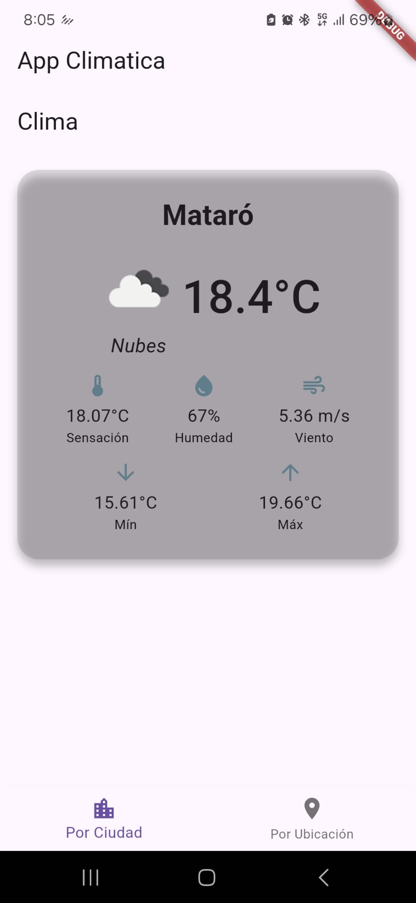
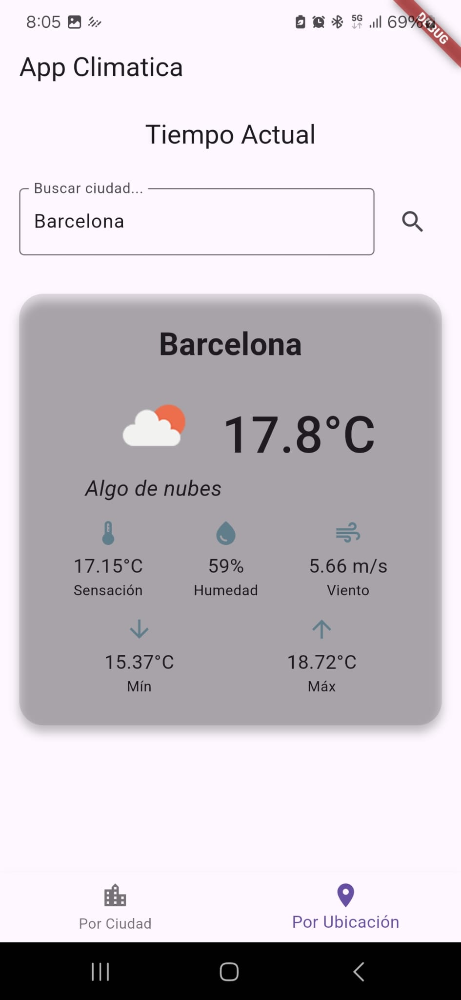

# 🌤️ App_climatica – Flutter

**App_climatica** es una aplicación móvil desarrollada en **Flutter** que permite consultar el clima actual en dos modalidades:
1. A partir de la **ubicación geográfica del dispositivo**
2. Introduciendo manualmente el **nombre de una ciudad o población**

Esta es la **primera versión finalizada y funcional** del proyecto. Utiliza la API de **OpenWeatherMap** para obtener información meteorológica en tiempo real.

---

## 📱 Funcionalidades principales

- 🔍 Consulta automática del clima actual mediante geolocalización
- 🏙️ Búsqueda manual por nombre de ciudad
- 🌡️ Visualización de:
    - Temperatura actual
    - Sensación térmica
    - Estado del cielo (despejado, nublado, lluvia, etc.)
    - Icono del clima correspondiente
---

## 🧰 Tecnologías utilizadas

- **Flutter** (Dart)
- **Geolocator** – Para obtener la ubicación del dispositivo
- **HTTP** – Para realizar llamadas a la API
- **OpenWeatherMap API** – Fuente de datos meteorológicos

---

## 📸 Capturas de pantalla

# Pantalla por ubicación:

# Pantalla por ciudad:

